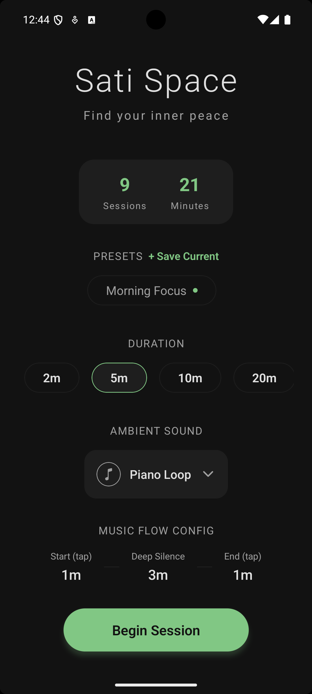
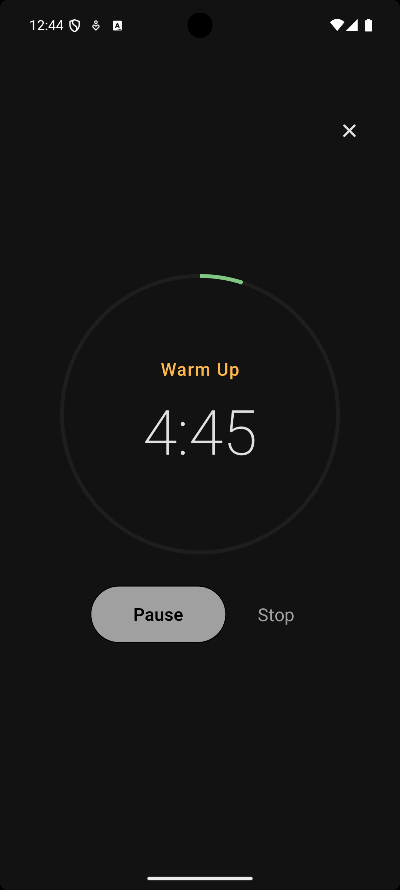
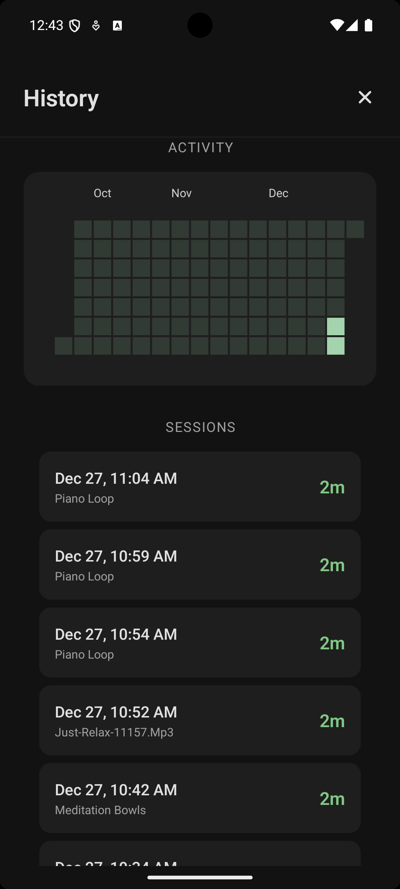
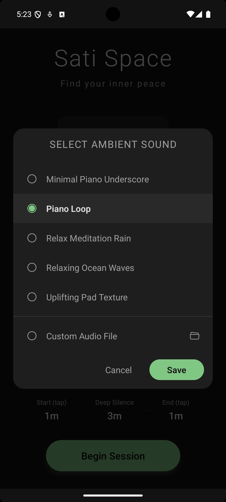

# 🧘‍♂️ Sati Space

**Sati Space** is a minimalist meditation timer designed for **silent meditation with intentional sound cues**.
It allows users to structure meditation sessions with **music only at the beginning and/or end**, supporting deeper focus and mindfulness.
The app is designed to work **fully offline**, enabling uninterrupted meditation sessions without requiring an internet connection.

This project was built as a **portfolio application**, showcasing mobile app development with **Expo, React Native, and TypeScript**, with attention to clean architecture, testing, **offline-first behavior**, and real-world mobile constraints.

---

## ✨ Key Concept

> **Silence is the core experience. Sound is used only as a guide.**

Unlike typical meditation apps that play continuous audio, **Sati Space** emphasizes:

* Long silent periods for deep meditation
* Gentle sound cues to mark transitions
* Full control over timing and audio sources (including user-provided files)

---

## 📱 Platform Support

* ✅ **Android** (APK available)
* ⏳ iOS (not supported yet)
* ❌ Web (not supported — mobile-first design)

---

## 📦 Try the App (Android)

👉 **Download APK:**
[Download APK (v1.0.0)](https://github.com/supakkit/sati-space-app/releases/download/v1.0.0/application-775aa1ca-37c0-4554-9e33-de839a799bd7.apk)

> ℹ️ You may need to enable **“Install unknown apps”** on your Android device.

> ℹ️ℹ️ This APK is unsigned for Play Store distribution and is intended for demo and portfolio purposes only.

---

## 🖼 Screenshots






---

## 🧩 Core Features

### ⏱ Timer & Session Management

* Custom meditation duration (preset or manual)
* Visual countdown timer
* Pause / resume during session
* Session completion feedback

---

### 🎵 Intelligent Background Music Control

* Music plays only during selected time windows

  * Example: first 5 minutes & last 1 minute
* Silent middle period for deep focus
* Smooth audio fade in/out
* Volume control

---

### 🔊 Audio Library & Custom Sounds

* Built-in ambient sounds (e.g. nature, bowls, white noise)
* Preview sounds before starting
* **Use your own audio files** from device storage
* Option for complete silence

---

### ⚙️ Session Presets

* Save favorite configurations
* Quick-start with presets
* Beginner-friendly default presets

---

## 🔁 Example User Flow

1. Open **Sati Space** app
2. Choose total duration (e.g. 20 minutes)
3. Select background sound (or own audio file)
4. Configure sound timing
   → Music for first 5 minutes, silence, music for last 1 minute
5. Tap **Start Session**
6. Start session
   → Music → silence → music → gentle ending cue

---

## 🛠 Tech Stack

### Core

* **Expo (Managed Workflow)**
* **React Native**
* **TypeScript**

### Audio & Native APIs

* `expo-audio`
* `expo-document-picker`
* `expo-file-system`
* `expo-crypto` (UUID generation)

### State & Storage

* `@react-native-async-storage/async-storage`
* Deterministic UUID handling for session data

### UI

* `@expo/vector-icons`
* `react-native-svg`
* `react-native-chart-kit`
* `react-native-circular-progress`
* Mobile-first, distraction-free design

---

## 🧪 Testing

* **Jest**
* **jest-expo**
* **@testing-library/react-native**
* Deterministic mocks for native APIs
* Proper handling of async state updates (`act`, `waitFor`)

Run tests:

```bash
npm test
```

Debug mode:

```bash
npm run test:debug
```

---

## 🚀 Development Setup

### Prerequisites

* Node.js (LTS)
* Expo CLI (via `npx`)
* Android device or emulator

### Install dependencies

```bash
npm install
```

### Run on Android

```bash
npx expo start
# press "a" to open on Android
```

Or scan QR code using **Expo Go** on a real device.

---

## 📦 Build (APK / AAB)

Built using **Expo Application Services (EAS)**.

```bash
eas build -p android --profile preview
```

This generates an installable APK suitable for:

* Portfolio demos
* Internal testing
* Non–Play Store distribution

---

## 🗺 Roadmap (Future Ideas)

* Background playback when screen is locked
* Guided meditation intervals
* iOS support
